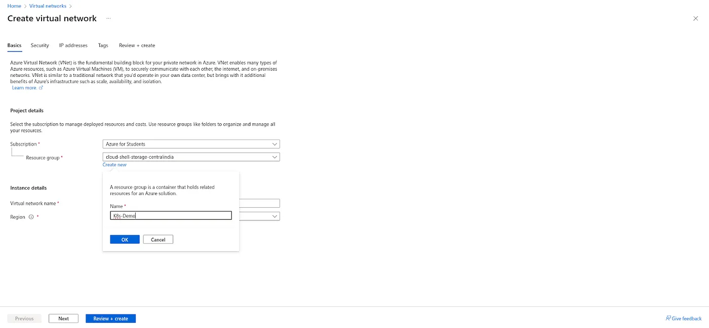
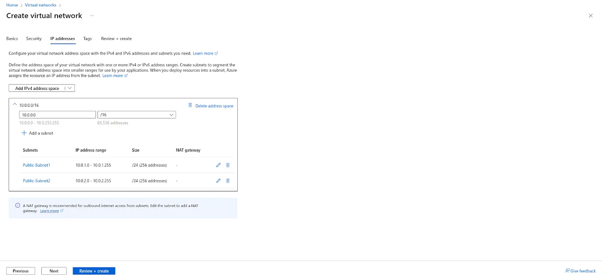

# Deploying Container Images With Azure Container Registry(ACR)


Azure Container Registry allows us to store, build and deploy images on Azure. The main benefit of using ACR comparing to Docker Hub is storing images in a private repository.

## Prerequisites
- Docker installed
- Azure CLI installed
## Build Your Image Locally

To build the image locally, first we will cd into the flask-app directory that contains the Dockerfile and use the commands to build the docker image:
```sh
cd flask-app
```

```sh
docker build -t <your_image_name>:<image-tag> .
```
Run the image using:
```sh
docker run -d -t <your_image_name>:<image-tag>
```

#### How It Works:
When you run a container with -p 5000:80, any traffic sent to port 5000 on the `` host `` will be forwarded to port 80 inside the container. 
For example:
    If the application is running inside the container on port 80, you can access it from your host machine via http://localhost:5000


## Create Azure Container Registry

We will create our Container Registry using Azure CLI. Make sure you have installed the Azure CLI in your terminal. From the Azure CLI we need to use the following command in our terminal.

```sh
az acr create --resource-group <resource_group_name> \
              --name <container_registry_name> \
              --sku Basic \
              --tags <tag-key>=<tag-value>
```
NOTE:
    Tagging your resources is crucial for tracking usage across different environments.
    

After creating Container Registry, you can view that by going to the Azure portal and on the search bar, type ``container registries`` and click on it.


That will take you to the ACR portal. Take note on the ``login server url`` as you will need it to push your image to your image to the container registry.


## Push Your Image To Container Registry 
Before pushing the image, we must authenticate with the Azure Container Registry(ACR). In the Azure CLI, run the 

```sh
az acr login --name <container_registry_name>
```
This will log you into the ACR, to push your image. Now run:

```sh
docker push <login_server_url>/<repository_name>:<tag>
```
After the push, verify that the image is in your Azure Container Registry:
```sh
az acr repository list --name <container_registry_name> --output table
```

## Deploying Image to AKS
To create an AKS cluster, you need to set up a VNet and other networking configurations.
If you're experienced with Azure, you can skip the networking setup. If you're new to AKS or Azure, I recommend following each step to understand the related services better.


Start by creating a new Resource Group. Click on "Create new" to proceed.



Provide the name of your Virtual Network and click on Next.


Create two public subnets for high availability in Azure Kubernetes:

Delete the default subnet.
Click ``Add a subnet`` and create two subnets with your desired IP ranges.
Click ``Next`` to proceed.




##### Create ACR


##### Grant AKS Access to ACR
Before running the kubectl apply, we need to grant access to the ACR and to do so, we need to attach the ACR to the AKS cluster so it can pull the image.

```sh
az aks update -n <aks-cluster-name> -g <resource-group-name> --attach-acr <acr-name>
```
To confirm the AKS cluster can pull images from ACR, run:

```sh
az acr list --resource-group <resource-group-name> --query "[].{acrLoginServer:loginServer}" --output table
```

It will display the ``registry login server``


##### Install kubectl


##### Apply yaml files
# Setting Up ELK Stack on Kubernetes: A Step-by-Step Guide
### ``** NOTE: I need to explain why daemonset, stableset, configMap is used **``

In this tutorial, I'll guide you through a step-by-step process for setting up the ELK stack (Elasticsearch, Logstash, and Kibana) on AKS cluster using YAML configuration files. We will setup NGINX Ingress and cert manager to encrypt our KIBANA dashboard over a secured HTTPS.

## Prerequisites

- A running Kubernetes cluster
- `kubectl` installed and configured to interact with your cluster
- Helm package manager installed

## Step 1: Create a Namespace

First, create a namespace for the ELK stack:

```sh
kubectl create namespace elk
```

## Step 2: Filebeat Configuration
##### Filebeat ConfigMap (filebeat-configmap.yaml)
```sh
apiVersion: v1
kind: ConfigMap
metadata:
  name: filebeat-config
  namespace: elk
data:
  filebeat.yaml: |
    filebeat.inputs:
      - type: container
        paths:
          - /var/log/containers/*.log
        processors:
          - add_kubernetes_metadata:
              in_cluster: true

    output.logstash:
      hosts: ["logstash:5044"]
```
##### Filebeat DaemonSet (filebeat-daemonset.yaml)
```sh
apiVersion: apps/v1
kind: DaemonSet
metadata:
  name: filebeat
  namespace: elk
  labels:
    k8s-app: filebeat
spec:
  selector:
    matchLabels:
      k8s-app: filebeat
  template:
    metadata:
      labels:
        k8s-app: filebeat
    spec:
      containers:
        - name: filebeat
          image: docker.elastic.co/beats/filebeat:7.10.0
          args: [
            "-c", "/etc/filebeat.yaml",
            "-e"
          ]
          volumeMounts:
            - name: config
              mountPath: /etc/filebeat.yaml
              subPath: filebeat.yaml
            - name: varlog
              mountPath: /var/log
            - name: varlibdockercontainers
              mountPath: /var/lib/docker/containers
              readOnly: true
      terminationGracePeriodSeconds: 30
      volumes:
        - name: config
          configMap:
            name: filebeat-config
        - name: varlog
          hostPath:
            path: /var/log
        - name: varlibdockercontainers
          hostPath:
            path: /var/lib/docker/containers
```
##### Apply the Filebeat ConfigMap & Deamonset
```sh
kubectl apply -f filebeat-configmap.yaml
kubectl apply -f filebeat-daemonset.yaml 
```

## Step 3: Elasticsearch Configuration
##### Elasticsearch (elasticsearch-statefulset.yaml):

```sh
apiVersion: apps/v1
kind: StatefulSet
metadata:
  name: elasticsearch
  namespace: elk
spec:
  serviceName: elasticsearch
  replicas: 1
  selector:
    matchLabels:
      app: elasticsearch
  template:
    metadata:
      labels:
        app: elasticsearch
    spec:
      containers:
        - name: elasticsearch
          image: docker.elastic.co/elasticsearch/elasticsearch:7.10.0
          ports:
            - containerPort: 9200
          env:
            - name: discovery.type
              value: "single-node"
          resources:
            limits:
              memory: "2Gi"
              cpu: "1"
```

##### Elasticsearch Service (elasticsearch-service.yaml):

```sh
apiVersion: v1
kind: Service
metadata:
  name: elasticsearch
  namespace: elk
spec:
  type: ClusterIP
  selector:
    app: elasticsearch
  ports:
    - protocol: TCP
      port: 9200
      targetPort: 9200
```
##### Apply the Elasticsearch StatefulSet and Service files:

```sh
kubectl apply -f elasticsearch-statefulset.yaml
kubectl apply -f elasticsearch-service.yaml
```

## Step 4: Logstash Configuration

##### Logstash Deployment & ConfigMap (logstash.yaml):

```sh
apiVersion: apps/v1
kind: Deployment
metadata:
  name: logstash
  namespace: elk
spec:
  replicas: 1
  selector:
    matchLabels:
      app: logstash
  template:
    metadata:
      labels:
        app: logstash
    spec:
      containers:
        - name: logstash
          image: docker.elastic.co/logstash/logstash:7.10.0
          ports:
            - containerPort: 5044
          volumeMounts:
            - name: config-volume
              mountPath: /usr/share/logstash/pipeline/
      volumes:
        - name: config-volume
          configMap:
            name: logstash-config
---
apiVersion: v1
kind: ConfigMap
metadata:
  name: logstash-config
  namespace: elk
data:
  logstash.conf: |
    input {
      beats {
        port => 5044
      }
    }
    output {
      elasticsearch {
        hosts => ["http://elasticsearch:9200"]
        index => "logstash-%{+YYYY.MM.dd}"
      }
    }
```

##### Logstash Service (logstash-service.yaml):

```sh
apiVersion: v1
kind: Service
metadata:
  name: logstash
  namespace: elk
spec:
  ports:
    - port: 5044
      targetPort: 5044
      protocol: TCP
  selector:
    app: logstash

```
##### Apply the Logstash Deployment, CofigMap and Service
```sh
kubectl apply -f logstash.yaml
kubectl apply -f logstash-service.yaml
```

## Step 5: Kibana Configuration
##### Kibana Deployment (kibana.yaml)

```sh
apiVersion: apps/v1
kind: Deployment
metadata:
  name: kibana
  namespace: elk
spec:
  replicas: 1
  selector:
    matchLabels:
      app: kibana
  template:
    metadata:
      labels:
        app: kibana
    spec:
      containers:
        - name: kibana
          image: docker.elastic.co/kibana/kibana:7.10.0
          ports:
            - containerPort: 5601
          env:
            - name: ELASTICSEARCH_HOSTS
              value: "http://elasticsearch:9200"

```

##### Kibana Service (kibana-service.yaml):

```sh
apiVersion: v1
kind: Service
metadata:
  name: kibana
  namespace: elk
spec:
  type: ClusterIP
  selector:
    app: kibana
  ports:
    - protocol: TCP
      port: 5601
      targetPort: 5601
```

##### Apply the Kibana Deployment and Service:

```sh
kubectl apply -f kibana.yaml
kubectl apply -f kibana-service.yaml
```

##### Next, check for all the running pods:
```sh
kubectl get pods -n elk
```


At this stage, we can either expose our Kibana dashboard using either LoadBalancer, Port Forwarding or Ingress. 


## Exposing Kibana service externally using Nginx Ingress & Cert Manager

This guide will show you how to set up Cert-Manager and NGINX Ingress on Kubernetes to automate TLS certificate management with Let’s Encrypt.
**Ingress** is a Kubernetes resource that manages external access to services within a cluster, typically HTTP and HTTPS traffic.
**Cert-Manager** automates the process of obtaining and renewing TLS certificates from providers like Let’s Encrypt. It integrates seamlessly with Ingress controllers (e.g., NGINX) to handle certificate management automatically.

##### Step 1: Create a Namespace

First, let's create a dedicated namespace for the Ingress controller:

```sh
kubectl create namespace ingress-basic 
```
##### Step 2. Installing Helm
Helm is a package manager for Kubernetes that simplifies the deployment and management of applications. First, we’ll install Helm.

```sh
curl https://raw.githubusercontent.com/helm/helm/master/scripts/get-helm-3 | bash
```
Verify the installation:

```sh
helm version
```
##### Step 3.  Installing NGINX Ingress Controller
The NGINX Ingress Controller manages HTTP and HTTPS traffic within Kubernetes. We’ll install it using Helm.

Add the Helm repository:
```sh
helm repo add ingress-nginx https://kubernetes.github.io/ingress-nginx
helm repo update
```


Before running the next command, Go to Azure Account search for Azure Load Balancer, and click on it.


There can be many load balancers if you have created if the load balancer name is Kubernetes click on it.


Once you land on the Kubernetes load balancer page, Click on Frontend IP Configuration and copy the IP address.


Next, install the Helm chart using the command below. Be sure to replace ``<PUBLIC-IP>`` with the Public IP address you copied in the earlier steps.

```sh
helm install ingress-nginx ingress-nginx/ingress-nginx \
    --namespace ingress-basic \
    --set controller.replicaCount=2 \
    --set controller.nodeSelector."kubernetes\.io/os"=linux \
    --set defaultBackend.nodeSelector."beta\.kubernetes\.io/os"=linux \
    --set controller.service.externalTrafficPolicy=Local \
    --set controller.service.loadBalancerIP="<PUBLIC-IP>"

```


To check if Ingress is installed, run the following command and ensure all pods are running.


Next, we’ll configure an SSL certificate for our application, which will be deployed within the next hour.

Run the following command to label ingress-basic for validation:
```sh
kubectl label namespace ingress-basic cert-manager.io/disable-validation=true
```


Add the cert manager helm repo and update the repo
```sh
helm repo add jetstack https://charts.jetstack.io
helm repo update
```


To configure SSL for our application, we need to create Custom Resource Definitions (CRDs). 

Run the following command:
```sh
kubectl apply -f https://github.com/cert-manager/cert-manager/releases/download/v1.7.1/cert-manager.crds.yaml
```


Install the cert manager helm chart

```sh
helm install cert-manager jetstack/cert-manager \
  --namespace ingress-basic \
  --version v1.7.1
```


Validate whether cert-manager pods are running or not


#### Step 4. Cluster Issuer Configuration
In this step, we’ll set up the Cluster Issuer, which handles SSL certificate management for our application.

##### Issuer (issuer.yaml)

```sh
apiVersion: cert-manager.io/v1
kind: ClusterIssuer
metadata:
 name: letsencrypt
spec:
 acme:
   server: https://acme-v02.api.letsencrypt.org/directory
   email: <your-email-address.com> # You must replace this email address with your own. Let's Encrypt will use this to contact you when your cert is about to expire.
   privateKeySecretRef:
    name: letsencrypt 
   solvers:
   - http01:
       ingress:
         class: nginx
         podTemplate:
           spec:
             nodeSelector:
               "kubernetes.io/os": linux
```

Run the following command:
```sh
kubectl apply -f issuer.yaml
```

#### Step 5. Ingress Configuration

At this stage, we will update the ingress file by adding annotations and configuring TLS settings.

```sh
apiVersion: networking.k8s.io/v1
kind: Ingress
metadata:
  name: ingresslb
  namespace: elk  # Make sure this matches the namespace of your configuration files'
  annotations:
    cert-manager.io/cluster-issuer: letsencrypt
    nginx.ingress.kubernetes.io/proxy-read-timeout: "120"
    nginx.ingress.kubernetes.io/proxy-send-timeout: "120"
spec:
  ingressClassName: nginx
  tls:
  - hosts:
    - <Add-your-domain-name>
    secretName: tls-secret
  rules:
    - host: <Add-your-domain-name>
      http:
        paths:
          - path: /
            pathType: Prefix
            backend:
              service:
                name: kibana
                port:
                  number: 5601
```

Run the following command:
```sh
kubectl apply -f ingress.yaml
```


##### Step 6: Verify Cert-Manager has issued a certificate:
The ``tls secret`` is the value of the ``secretName`` in the Ingress file

```sh
kubectl describe certificate tls-secret -n elk
```


```sh
kubectl get cert
```


##### Step 7: Verify ingress:

```sh
kubectl get ingress -n elk
```


I've added the public IP provided by Ingress on my domain provider.


Hit the hostname from your browser, and you should see the Kibana dashboard.

Congratulations! You have successfully deployed the ELK Stack to your AKS cluster with HTTPS enabled.


## Conclusion

This structure provides a comprehensive guide for deploying the ELK Stack (Elasticsearch, Kibana, and Logstash) on Azure AKS using YAML configuring files and ensuring security best practices for production environments.

For more detailed configurations and customizations, refer to the official [Elastic Helm Charts documentation](https://github.com/elastic/helm-charts).


